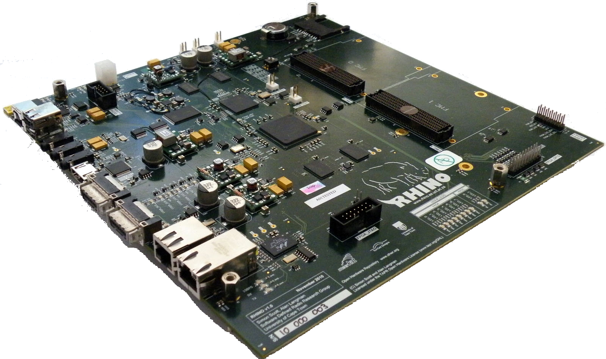

RHINO DOCS
==========

Set of basic tutorials/building blocks for using the RHINO platform and its features.

.. toctree::
   :maxdepth: 2
   :caption: Contents:

   setting_up_nfs

Contributors
------------

#.  `Gordon Iggs <mailto:gordon.e.inggs@ieee.org>`_
#.  `Matthew Bridges <mailto:matthewbridges88@gmail.com>`_
#.  `Lerato Mohapi <mailto:leratojeffrey.mohapi@gmail.com>`_
#.  `Lekhobola Tsoeunyane <mailto:lekhobola@gmail.com>`_
#.  `Brad Kahn <mailto:bradkahn92@gmail.com>`_
#.  `Alan Langman <mailto:alan.langman@gmail.com>`_
#.  `Simon Scott <mailto:sscott.za@gmail.com>`_
